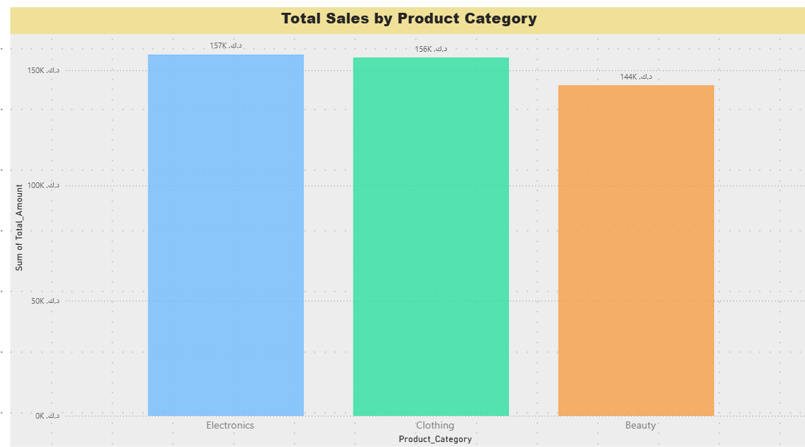
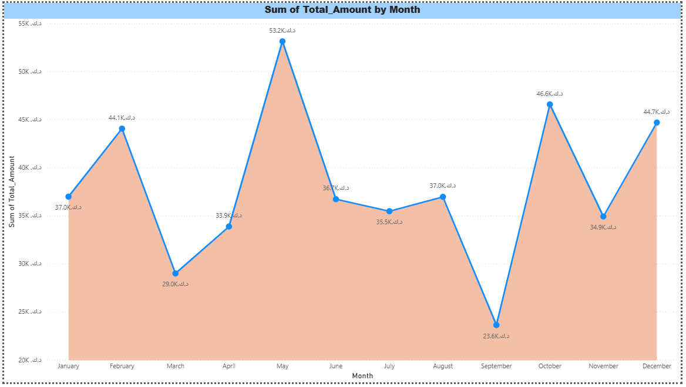
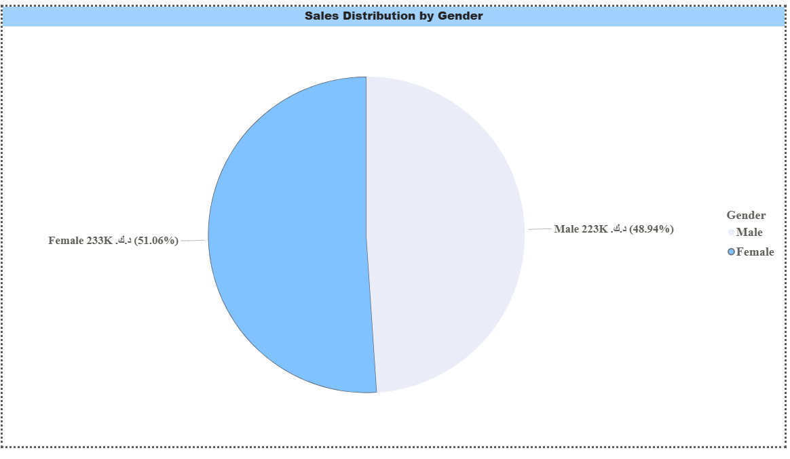
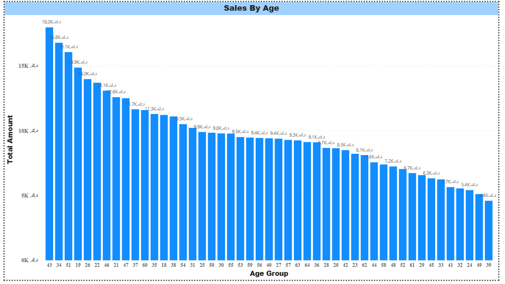
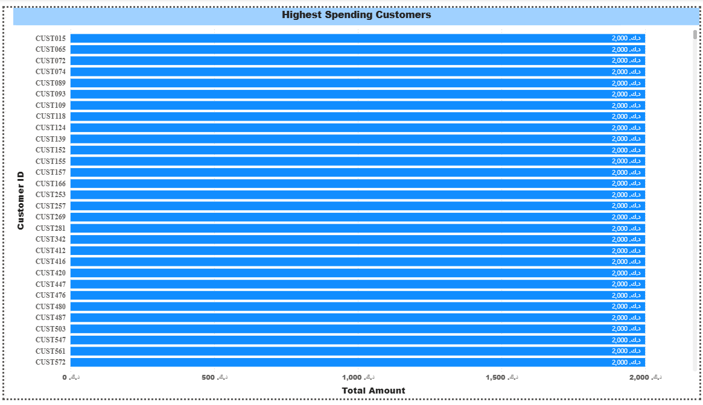
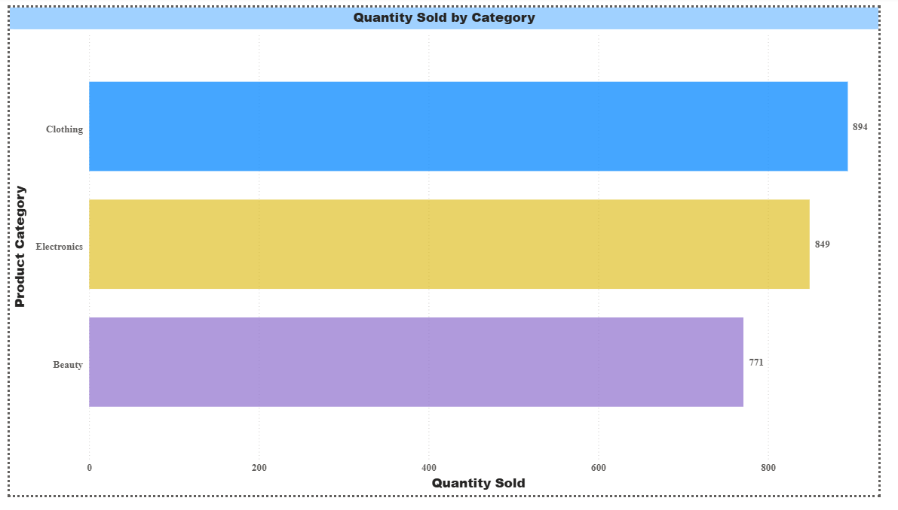
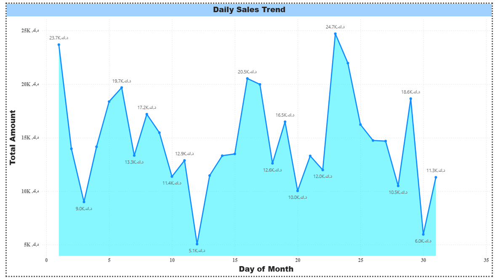

# Retail Sales Analysis Dashboard
This project analyzes retail sales data using SQL and Power BI to identify sales trends, customer behavior, and business insights through interactive dashboards and data visualization.

## SQL & Power BI Project for Business Insights and Data Visualization

## Tools Used
- SQL
- Power BI

## Power BI Features Used
- Bar Chart
- Area Chart
- KPI Cards
- Filters/Slicers

# Retail Sales Analysis using SQL & Power BI

This project analyzes retail sales data using SQL and Power BI to identify sales trends, customer behavior, and business insights through interactive dashboards and data analysis.

## Business Recommendations

- Focus on high-performing product categories to increase revenue.
- Improve customer retention through loyalty programs and offers.
- Use sales trends to plan seasonal promotions and marketing campaigns.
- Optimize inventory management based on product demand.
- Monitor sales performance regularly using dashboards for better decision-making.

 ## Business Questions

## 1. Which product category generates the highest revenue?
```Sql
SELECT Product_Category, SUM(Total_Amount) AS
Total_Revenue
FROM retail_sales
GROUP BY Product_Category
ORDER BY Total_Revenue DESC;
```
### Insight:
Electronics was the top-performing product category by revenue.

## 2. Which month has the highest sales?
```Sql
SELECT MONTH(Date) AS Month,
       SUM(Total_Amount) AS Total_Sales
FROM retail_sales
GROUP BY MONTH(Date)
ORDER BY Total_Sales DESC; 
```
### Insight:
I analyzed monthly sales trends and found that Month 5 recorded the highest sales performance compared to all other months. This indicates a peak in customer demand during that period.

## 3. Which gender contributes more to total sales?
```Sql
SELECT Gender,
       SUM(Total_Amount) AS Total_Sales
FROM retail_sales
GROUP BY Gender;
```
### Insight:
Sales analysis showed that male customers generated the highest contribution to overall revenue.

## 4. What is the average spending per customer?
```Sql
SELECT Customer_ID,
       AVG(Total_Amount) AS Avg_Spending
FROM retail_sales
GROUP BY Customer_ID
ORDER BY Avg_Spending DESC;
```
### Insight:
 The analysis identified multiple customers with an average spending amount of 2000, representing the top-spending customer segment

## 5. Which age group purchases the most?
```Sql
SELECT
CASE
    WHEN Age BETWEEN 18 AND 25 THEN '18-25'
    WHEN Age BETWEEN 26 AND 35 THEN '26-35'
    WHEN Age BETWEEN 36 AND 45 THEN '36-45'
    ELSE '46+'
END AS Age_Group,
SUM(Total_Amount) AS Total_Sales
FROM retail_sales
GROUP BY Age_Group
ORDER BY Total_Sales DESC;
```
### Insight:
Sales analysis revealed that customers aged 46 and above were the top purchasing age group, contributing the highest sales volume.

## 6. Which customers are top spenders?
```Sql
SELECT Customer_ID,
       SUM(Total_Amount) AS Total_Spending
FROM retail_sales
GROUP BY Customer_ID
ORDER BY Total_Spending DESC
LIMIT 10;
```
### Insight:
Multiple customers were identified as top spenders, each with the same total spending value of 2000.

## 7. What is the total quantity sold by category?
```Sql
SELECT Product_Category,
       SUM(Quantity) AS Total_Quantity_Sold
FROM retail_sales
GROUP BY Product_Category
ORDER BY Total_Quantity_Sold DESC;
```
### Insight:
Category-wise sales analysis showed that Clothing was the top-selling category based on total quantity sold.

## 8. What is the daily sales trend?
```Sql
SELECT Date,
       SUM(Total_Amount) AS Daily_Sales
FROM retail_sales
GROUP BY Date
ORDER BY Daily_Sales desc;
```
### Insight:
The daily sales trend revealed fluctuations in sales performance over time, with peak sales of 8,455 recorded on 05/23/2023.

## 9. Which product category has the highest average transaction value?
```Sql
SELECT Product_Category,
       AVG(Total_Amount) AS Avg_Transaction_Value
FROM retail_sales
GROUP BY Product_Category
ORDER BY Avg_Transaction_Value DESC;
```
### Insight:
 Analysis of average transaction values showed that the Beauty category generated the highest average purchase value compared to other product categories.

## 10. What is the total revenue generated?
```Sql
SELECT SUM(Total_Amount) AS Total_Revenue
FROM retail_sales;
```
### Insight:
The dataset generated a total revenue of 456,000 from overall sales transactions.

## Power BI Dashboard Questions & KPIs
•KPI Cards

•Total Revenue

•Total Orders

•Total Quantity Sold

•Average Order Value

•Total Customers

## Dashboard Visualizations
1. Sales by Product Category
<p align="center">
  
</p>
Business Insight:
Electronics was the top-performing product category by revenue.

## 2. Monthly Sales Trend
<p align="center">
  
</p>
Business Insight:
Month 5 recorded the highest sales, showing peak customer demand during this period.

## 3. Sales by Gender
<p align="center">
  
</p>
Business Insight:
Male customers contributed the highest share of overall revenue.

## 4. Sales by Age Group
<p align="center">
  
</p>
Business Insight:
Customers aged 46+ contributed the highest sales volume among all age groups.

## 5. Highest Spending Customers
<p align="center">
  
</p>
Business Insight:
The analysis identified multiple customers with an average spending amount of 2000, representing the top-spending customer segment.

## 6. Quantity Sold by Category
<p align="center">
  
</p>
Business Insight:
Clothing was the top-selling category based on total quantity sold.

## 7. Daily Sales Trend
<p align="center">
  
</p>
Business Insight:
Daily sales showed fluctuations, with a peak of 8,455 recorded on 05/23/2023.

## Final Project Conclusion
This project demonstrates practical data analyst skills by combining SQL analysis with Power BI dashboard visualization. It provides valuable business insights into customer behavior, product performance, and sales trends. The project showcases the ability to transform raw data into actionable business intelligence.
